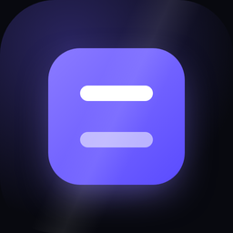

<p align="center"></p>
<h1 align="center">Gap</h1>
<p align="center"><b>The market’s closed. The chain isn’t.</b><br>Live premium / discount of every stock token on Robinhood Chain vs the real market.</p>

---

## What it is

Robinhood Chain stock tokens trade 24/7 in Uniswap v4 pools against USDG. NYSE trades 9:30–16:00 New York, five days a week. Whenever the market is shut, the on-chain price is the only price that can move — so it drifts away from the last real one. That drift is the **gap**.

Gap is the live table of it: all 95 stock tokens, on-chain price vs market price, gap %, 24h on-chain move, volume, liquidity, buy/sell flow, straight to the pool. Plus a NYSE countdown, a watchlist, browser alerts when a gap opens past your threshold, and a ticker tape.

$GAP is the key. Hold the gate amount and the full terminal opens. No staking, no contract — the balance is read from the chain when a wallet connects.

## Connect a wallet and you get

- **Your positions** — every stock token in the wallet, valued on-chain (raw balance × pool price) and at the market (split-adjusted balance × real price), with the gap and the dollar difference per name and in total. Plus a **Yours** filter on the main table.
- **A watchlist that follows the wallet** — stars are saved per address. With the store below configured, one signature saves them to the cloud so they're there on your phone too; without it they're saved per address on the device.
- **The gate** — full table + alerts once `gateAmount` is set and the wallet holds it.

Nothing is ever signed except the optional watchlist save, and that is a plain-text message, not a transaction.

## How it works

```
browser ──► /api/gap  (Vercel serverless, cached 45s)
               ├── GeckoTerminal  → on-chain price, volume, liquidity, buys/sells per stock-token pool (no key)
               └── Finnhub (if FINNHUB_KEY) or Yahoo chart endpoint → last real market price, previous close
```

The function merges both sides, computes `gap = onchain / market − 1`, and returns one JSON. It refreshes market quotes in slices so it never trips the free rate limits, and barely refreshes them at all while the market is closed (closes don't move).

If the API is unreachable the page falls back to reading GeckoTerminal directly (on-chain side only), and if that fails too it shows clearly-labelled sample data.

## Deploy

1. Push this repo to GitHub.
2. Vercel → Add New → Project → import. Framework **Other**, no build command, no root directory. The `api/` folder is picked up automatically.
3. (Recommended) Project → Settings → Environment Variables → `FINNHUB_KEY` = a free key from finnhub.io. Without it the function uses Yahoo's public chart endpoint, which works but is unofficial.
3b. (Optional, for cloud watchlists) Project → Storage → Create → **Upstash Redis** (free tier). It adds `KV_REST_API_URL` and `KV_REST_API_TOKEN` to the project automatically. Skip it and watchlists stay per wallet per device.
4. Deploy. Open `/api/gap` on your domain — you should see JSON with 95 rows.

## The video

The hero plays a looping MP4 from the `video` line in the config. Swap the URL for your own (a dark 16:9 clip, ~1500×1050, loops cleanly). If it fails to load the page draws a simple light-column scene instead, so nothing breaks.

## Launch day

Top of `index.html`:

```js
window.GAP_CONFIG = {
  token:   '0x…',          // $GAP contract address from Pons → buy button goes live, gating switches on
  gateAmount: 250000,      // $GAP needed to unlock the full table + alerts. 0 = everything open
  x:       'https://x.com/…',
  github:  'https://github.com/…',
  walletConnectProjectId: '…'   // from cloud.reown.com; add your Vercel domain to its allowlist
};
```

Leave `gateAmount` at 0 for launch week so everyone sees the whole thing, then set it.

## Where the fees go

Pons creator fees pay for the data feeds and a weekly bounty — the widest gap of the week, called first in the community, paid in USDG. Every payout posted with its transaction. There is no vault and no contract; what you see is a site and a fee wallet.

## Files

```
index.html       the site: cinematic stage (looping video, Manrope) + the terminal (single file, no build)
api/gap.js       serverless function: GeckoTerminal + market quotes → one JSON
api/watch.js     per-wallet watchlist (signature-checked) on Upstash Redis — optional
api/tokens.json  the 95 stock tokens on Robinhood Chain with names
vercel.json      function config + CORS on /api
favicon.png · og.png
```

## Honest bits

Prices can lag by a minute. GeckoTerminal and the quote APIs are third parties and can hiccup; the page says so when they do. Stock tokens on Robinhood Chain are not shares. Not affiliated with Robinhood Markets, Inc. or Pons. Nothing here is financial advice.
