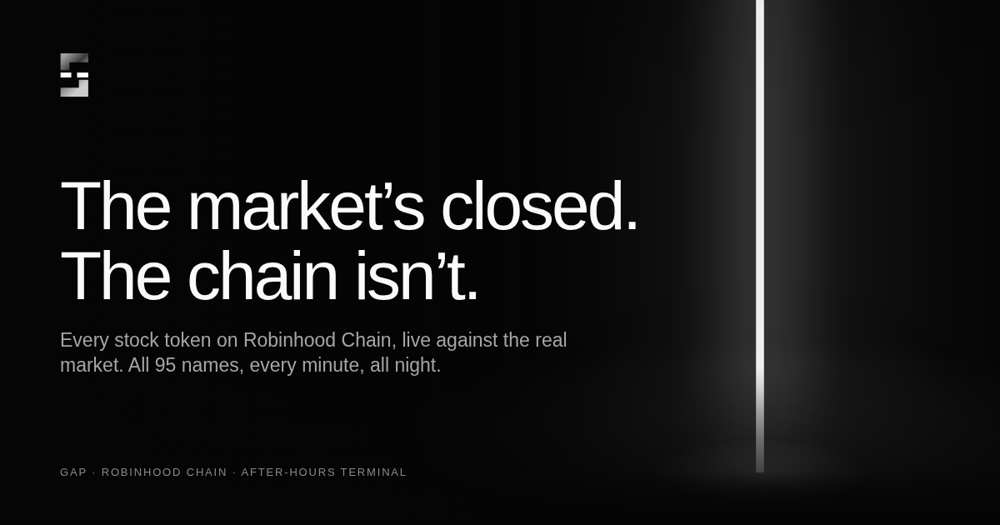

<p align="center"></p>
<h1 align="center">Gap</h1>
<p align="center"><b>The market’s closed. The chain isn’t.</b><br>Live premium / discount of every stock token on Robinhood Chain against the real market.</p>
<p align="center"><a href="https://gap-bay.vercel.app">gap-bay.vercel.app</a></p>

<p align="center"></p>

---

## What it is

Robinhood Chain stock tokens trade 24/7 in Uniswap v4 pools. NYSE trades 9:30–16:00 New York, five days a week. Whenever the market is shut, the on-chain price is the only price that can move, so it drifts away from the last real one. That drift is the **gap**.

Gap is the live table of it — all 95 names, on-chain price against market price, the gap, 24h on-chain move, volume, liquidity, buy/sell flow, and a link straight to the pool. Plus a NYSE countdown, a watchlist, browser alerts when a gap opens past your threshold, and a ticker tape.

## The site

Two views, one file.

**Landing** — a fixed, full-screen stage: the mark, the nav, one headline, a looping video, the four data partners in the bottom fade. Nothing scrolls.

**Terminal** — "Open terminal" crossfades into it. Stats up top, then the table, alerts, and how it works. Driven by the hash, so `/#terminal`, `/#alerts`, `/#how` and `/#gap` deep-link into it and the back button returns to the landing.

### Connect a wallet and you get

- **Your positions** — every stock token in the wallet, valued on-chain (raw balance × pool price) and at the market (split-adjusted balance × real price), with the gap and the dollar difference per name and in total. Plus a **Yours** filter on the main table.
- **A watchlist that follows the wallet** — stars are saved per address. With the store below configured, one signature saves them to the cloud so they're there on your phone too; without it they're saved per address on the device.
- **The gate** — full table + alerts once `gateAmount` is set and the wallet holds it.

Nothing is ever signed except the optional watchlist save, and that is a plain-text message, not a transaction.

## How the data works

```
browser ──► /api/gap  (Vercel serverless, cached 45s)
               ├── GeckoTerminal  → on-chain price, volume, liquidity, buys/sells, logo — per stock-token pool (no key)
               └── Finnhub (if FINNHUB_KEY) or Yahoo chart endpoint → last real market price, previous close

browser ──► /api/watch (optional) → per-wallet watchlist on Upstash Redis, signature-checked
```

The function merges both sides, computes `gap = onchain / market − 1`, and returns one JSON. It refreshes market quotes in slices so it never trips the free rate limits, and barely refreshes them while the market is closed (closes don't move). If the API is unreachable the page reads GeckoTerminal directly (on-chain side only), and if that fails too it shows clearly-labelled sample data.

## Deploy

1. Push this repo to GitHub — `api/` must be a folder at the root, next to `index.html`.
2. Vercel → Add New → Project → import. Framework **Other**, no build command, no root directory.
3. Project → Settings → Environment Variables → `FINNHUB_KEY` = a free key from finnhub.io (recommended; without it the function uses Yahoo's public endpoint).
4. Optional, for cloud watchlists: Project → Storage → Create → **Upstash Redis** (free tier). It adds `KV_REST_API_URL` / `KV_REST_API_TOKEN` automatically.
5. Deploy, then open `/api/gap` on your domain — you should see JSON with 95 rows.

## Launch day

Top of `index.html`:

```js
window.GAP_CONFIG = {
  token:   '0x…',          // $GAP contract address from Pons → buy button goes live, gating switches on
  gateAmount: 250000,      // $GAP needed to unlock the full table + alerts. 0 = everything open
  video:   'https://…mp4', // the hero loop; swap for your own clip
  x:       'https://x.com/…',
  github:  'https://github.com/…',
  walletConnectProjectId: '…'   // from cloud.reown.com; add your Vercel domain to its allowlist
};
```

Leave `gateAmount` at 0 for launch week so everyone sees the whole thing, then set it.

## Where the fees go

Pons creator fees pay for the data feeds and a weekly bounty — the widest gap of the week, called first in the community, paid in USDG. Every payout posted with its transaction. There is no vault and no contract; what you see is a site and a fee wallet.

## Files

```
index.html       the site: landing stage + terminal (single file, no build)
api/gap.js       serverless function: GeckoTerminal + market quotes → one JSON
api/watch.js     per-wallet watchlist (signature-checked) on Upstash Redis — optional
api/tokens.json  the 95 stock tokens on Robinhood Chain with names
package.json     ethers (for the signature check) — Vercel installs it
vercel.json      clean URLs + CORS on /api
favicon.png · logo.png · og.png
```

## Honest bits

Prices can lag by a minute. GeckoTerminal and the quote APIs are third parties and can hiccup; the page says so when they do. Stock tokens on Robinhood Chain are not shares. Not affiliated with Robinhood Markets, Inc. or Pons. Nothing here is financial advice.
